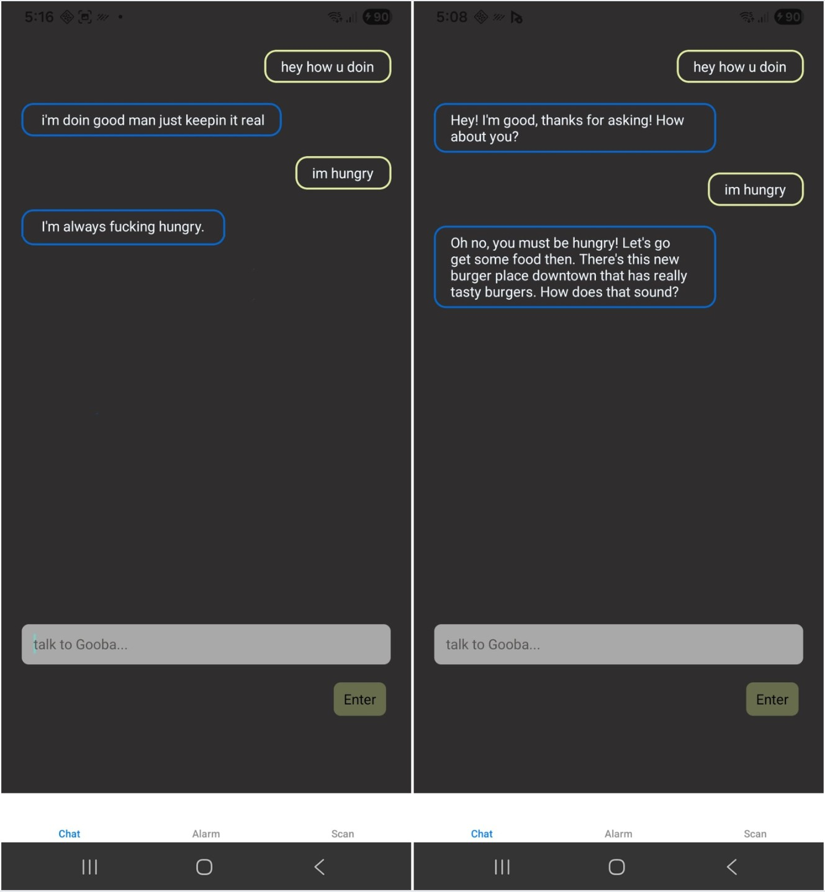
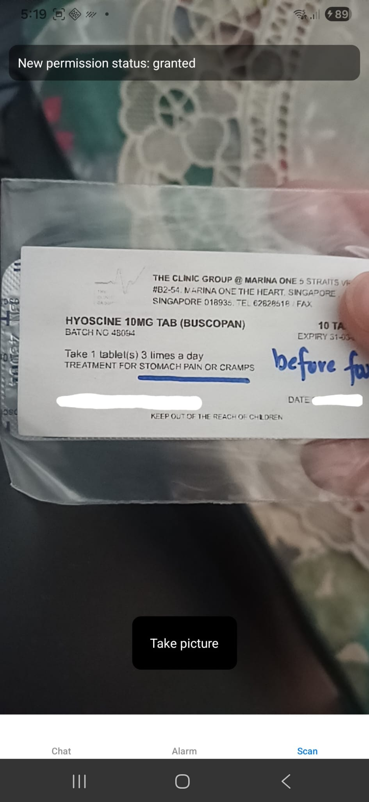
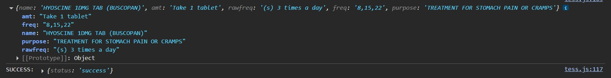

# Project: Fwen

- 🗪 Feel free to telegram me [@milkbottledude](https://t.me/milkbottledude) if you have any questions, or just want to chat :)

## Overview 🔍
Welcome to Fwen, a React Native APK app made for the elderly!

Population aging is occuring at a rapid rate, not just in Singapore but in most developed countries as well.

As I interact with more elderly, the more apparent it becomes that I need to do more for our nation's pioneers.

According to my many interactions with the elderly from my volunteer runs with Signpost Collective, I have narrowed down the most common issues the elderly face:

1) **Loneliness**
2) **Health**
3) Wealth (for tissue peddlers)

While I can't do much about the third point aside from raising funds and collaborating with organizations that are up for sponsoring, I can tackle the top 2 with my current tech skills. Fwen was made specifically for these 2 issues.

## Loneliness

To tackle **loneliness**, we need someone who is able to engage in conversation whenever, wherever. Naturally, a ChatGPT or Claude chatbot comes to mind.

However, I wanted each elderly's chatbot to be personalized to them, so naturally I would need access to the model to be able to tune it as such. Simply using an AI company's API will not give such control.

The worry of privacy also comes to mind: These companies have sucked enough of our data, and I don't want to play a part in supplying them with more.

That is why the I'm using a lightweight open-source Mistral 3B model for Fwen's chatbot base. It is hosted locally on my own home server (old i7 desktop running Linux). 

This way, I can add training data tailored to each elderly and train the model without others being able to see the data, as well as edit the system prompts. For example, if the elderly likes baking, I can train the model on wholesome conversations about baking. I can also change the system prompt to make the chatbot impersonate a fellow elderly who loves baking.

So far for testing, I have trained one model instance on a handful of friendly banter conversations on Youtube, and another on some David Goggins dialogue 😅. Here is me talking to them through the app's user interface frontend on an Android Studio emulator (virtual phone), I think you can tell which model is which.

- Fig a: Chatting with locally hosted model (mildly trained)

There will be no record of the conversation logs between the elderly and chatbot, making sure that this data will not be seen by anyone, and especially not any data grubbing companies.

## Health

Every time I head down to chat with my elderly friends, the topic of medicine always come up. How many 'x' to take, how much ml of 'y' to drink, how often, what they do.

Its a lot to take in, let alone remember day in day out. And its quite scary to think that this controls their health. Once mix up is all it takes for them to get more sick or worse.

Fwen's medicine scanner removes the complications of taking medicine. Users simply have to scan the medicine's label, and the built-in OCR will parse the relevant information. Medicine name, its purpose, how much to take and when, all this is sent to the server and stored in an SQL database.

- Fig c: Scanning medicine label

- Fig b: Filtering data from parsed text and sending to server

After that, a reminder is added to the 'Alarm' tab. When the time comes to take that particular medicine, the phone will ring, as well as display the name of the medicine and the amount to take.

So far, these are the features I have come up with. However, if you have any more ideas on how this app can help the elderly more, do reach out to me on telegram, I'm always open to suggestions :)
